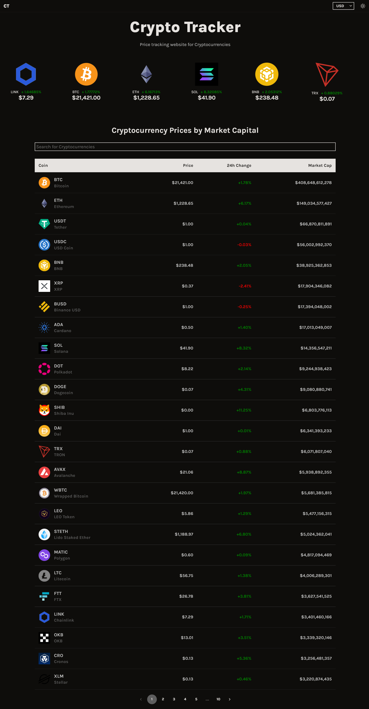
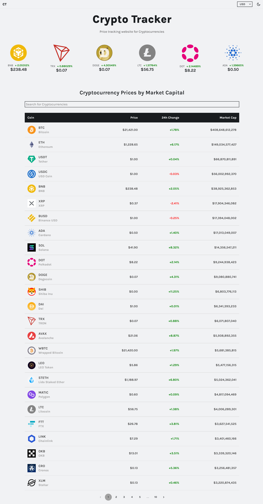
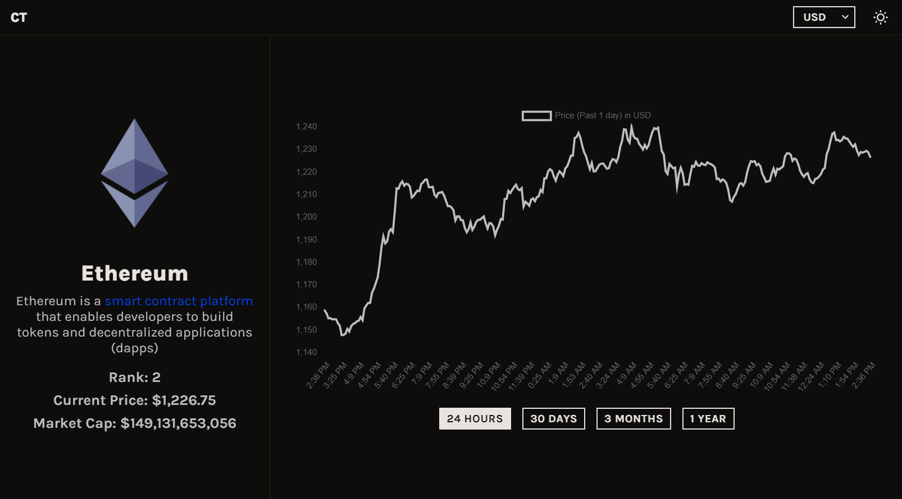
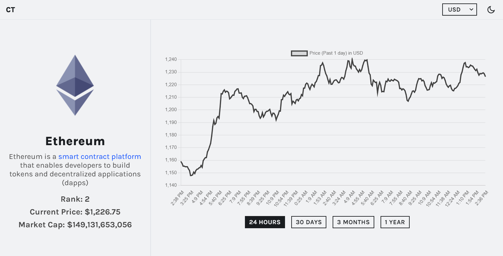

# Crypto Tracker

This is a website for tracking Cryptocurrencies, built with React. Has Dark and Light themes.
API used: [CoinGecko](https://www.coingecko.com/en/api/documentation) (Free and no authentication needed).

## Demo

Here is the live website: [Crypto Tracker](https://mcryptotracker.netlify.app/).

## Technologies

- React
- Styled Components
- Material UI
- Chart.js

## Installation

Clone this repository. And in the project directory run:

#### `npm install`

To start the app run:

#### `npm start`

Open [http://localhost:3000](http://localhost:3000) to view it in your browser.

#### `npm run build`

Builds the app for production to the `build` folder

## Screenshots

|                             Dark Mode                             |                             Light Mode                             |
| :---------------------------------------------------------------: | :----------------------------------------------------------------: |
|  |  |
|   |  |
